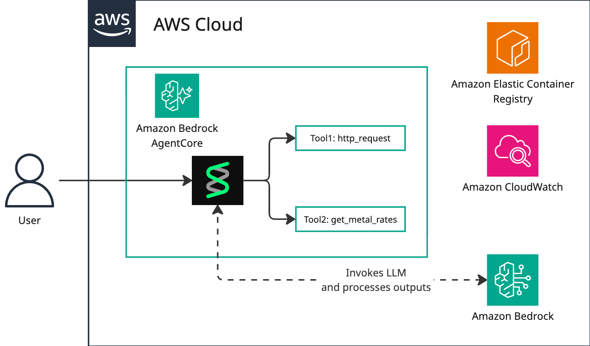

# Bedrock AgentCore Weather & Metal Rates Agent

An AI agent deployed on AWS Bedrock AgentCore that provides weather forecasts and metal commodity rates using the Strands framework.

## Features

- **Weather Information**: Fetches weather forecasts for US locations using the National Weather Service API
- **Metal Commodity Rates**: Retrieves current gold and silver prices in USD
- **Containerized Deployment**: Runs as a Docker container on AWS Bedrock AgentCore
- **ARM64 Architecture**: Optimized for Bedrock AgentCore's ARM64 platform

## Architecture



This solution deploys an AI agent built with the Strands SDK, equipped with two capabilities: retrieving weather forecasts and fetching metal commodity rates. The agent leverages the "minimax.minimax-m2.5" Bedrock Foundation Model for natural language understanding and response generation.

Project structure

```
├── agent-app/          # Application code
│   ├── Dockerfile      # Container definition
│   └── weather.py      # Agent implementation
├── agent-infra/        # Terraform infrastructure
│   ├── agentcore.tf    # Bedrock runtime configuration
│   ├── ecr.tf          # ECR repository
│   ├── iam.tf          # IAM roles and policies
│   ├── cloudwatch.tf   # Logging configuration
│   └── variables.tf    # Terraform variables
├── deploy-fresh.sh     # Fresh deployment script
└── update-runtime.sh   # Update existing runtime
```

## Prerequisites

- AWS CLI configured with appropriate credentials
- Docker installed (with buildx for Apple Silicon)
- Terraform >= 1.0
- AWS Account with Bedrock AgentCore access
- AWS Region: eu-west-1 (configurable)

## Environment Variables

| Variable | Default | Description |
|----------|---------|-------------|
| `AWS_REGION` | eu-west-1 | AWS region for deployment |
| `IMAGE_TAG` | latest | Docker image tag for versioning |

## Deployment

### Fresh Deployment

Deploys all infrastructure and creates the Bedrock runtime:

```bash
./deploy-fresh.sh
```

**Process:**
1. Creates ECR repository, IAM roles, and CloudWatch log groups
2. Builds Docker image for linux/arm64 platform
3. Pushes image to ECR with specified tag
4. Creates Bedrock AgentCore runtime

### Update Existing Runtime

Updates the Docker image and runtime configuration:

```bash
# Using default tag (latest)
./update-runtime.sh

# Using custom tag
IMAGE_TAG=v1.0.0 ./update-runtime.sh

# Using timestamp-based tag
IMAGE_TAG=$(date +%Y%m%d-%H%M%S) ./update-runtime.sh
```

## IAM Permissions

The agent runtime has permissions for:
- **ECR**: Pull container images
- **CloudWatch Logs**: Write logs to `/aws/bedrock-agentcore/runtimes/*`
- **Bedrock**: Invoke foundation models (minimax.minimax-m2.5)
- **X-Ray**: Tracing and telemetry
- **CloudWatch Metrics**: Custom metrics for bedrock-agentcore namespace
- **EFS/S3 Files**: File system access (if needed)

## Agent Capabilities

### Weather Queries
- "What's the weather in San Francisco?"
- "Show me the forecast for New York"
- Uses National Weather Service API

### Metal Rates
- "What's the current gold price?"
- "Get silver rates"
- Real-time commodity pricing in USD

## Configuration

### Terraform Variables

Edit `agent-infra/variables.tf` or pass via command line:

```bash
terraform apply -var="agent_name=my-agent" -var="image_tag=v2.0.0"
```

### Model Configuration

Change the model in `agent-app/weather.py`:

```python
agent_model = BedrockModel(model_id="minimax.minimax-m2.5", region_name="eu-west-1")
```

## Testing

Generate a test session ID (33+ characters required):

```bash
echo "test-session-$(date +%Y%m%d%H%M%S)-$(uuidgen | cut -c1-8)"
```

Invoke the runtime:

```bash
aws bedrock-agentcore invoke-agent-runtime \
  --agent-runtime-id <runtime-id> \
  --session-id "test-session-$(date +%Y%m%d%H%M%S)-$(uuidgen | cut -c1-8)" \
  --prompt "What's the weather forecast?" \
  --region eu-west-1
```

## Logs

View runtime logs:

```bash
aws logs tail /aws/bedrock-agentcore/runtimes/weatheragent --follow --region eu-west-1
```

## Cleanup

```bash
cd agent-infra
terraform destroy -auto-approve
```

## Troubleshooting

**Issue**: Architecture incompatible error
- **Solution**: Ensure Docker image is built for `linux/arm64` platform

**Issue**: Invalid reference format for docker tag
- **Solution**: Scripts now suppress Terraform colored output with `2>/dev/null`

**Issue**: ECR image tag is immutable
- **Solution**: Use `IMAGE_TAG` environment variable with unique values (timestamps/versions)

## License

MIT
